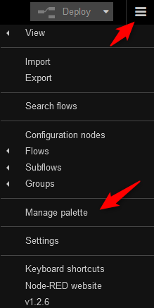
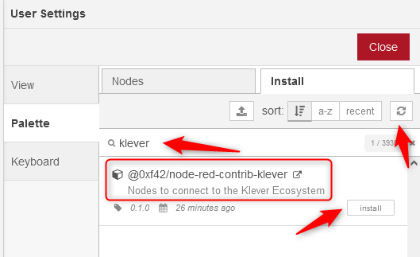
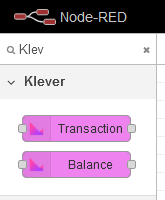
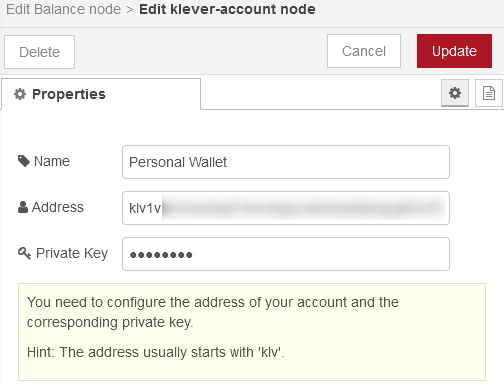
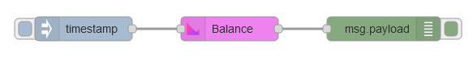
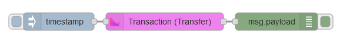
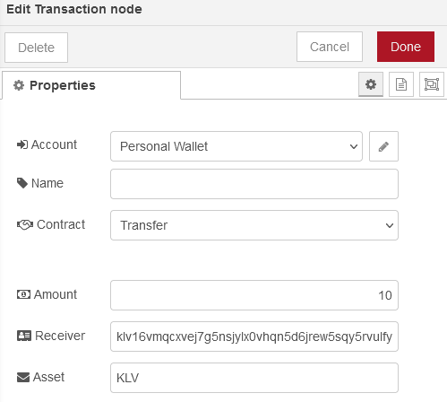

# Node-RED nodes for Klever


## About

The [Klever Finance Ecosystem](https://klever.finance/) has the goal to create innovative, easy-to-use and secure products powered by peer-to-peer and blockchain technologies. It is powered by a professional crypto company and a community of crypto enthusiasts which are involved in building, running, improving and supporting the Klever blockchain.

[Node-RED](https://nodered.org/) is a popular open-source low-code development and execution platform that lets you build a wide range of solutions using a visual programming style. Its browser-based flow editor that makes it easy to wire together flows and define program logic.
Node-RED can be used for rapid application prototyping, service development, process automation and is especially popular in the field of the Internet of Things (IoT). Using the wide range of available nodes in the palette it is possible to connect to many devices, sensors, actors, internet services, databases, social media platforms or to create web-based user interfaces. Flows can be then deployed to the runtime in a single-click.
The light-weight runtime is built on Node.js, taking full advantage of its event-driven, non-blocking model. This makes it very flexible and allows to run at the edge of the network, on low-cost hardware (e.g. Raspberry Pi) as well as in the cloud.

This repository is a community driven project and adds direct support for the Klever Ecosystem within the Node-RED.

By installing these nodes within Node-RED you can now use Node-RED to easily:

* Query the balance of a given account
* Send transactions to the Kleverchain like:
  * Transfer KLV from one account to another
  * Freeze KLV
  * Unfreeze KLV
  * Delegate frozen KLV to a receiver for staking
  * Undelegate KLV
  * Claim your staked KLV
* Manage your validator:
  * Unjail a validator connect to your account
* ...

By that, KleverChain and these nodes enable you to __monetize your IoT Application__.

*(Developing for) Blockchain is difficult, but it shouldn't be. With Node-RED nodes for KleverChain anyone can build*

## Install

### Installation of Node-RED

In order to use the `Node-RED nodes for Klever` you need to install Node-RED first. As there are many guidelines already available, we dont'go into detail here. You may have a look at the official guidelines at <https://nodered.org/docs/getting-started/> to setup your own instance of Node-RED (e.g. on docker) or use one of many SaaS offerings in the cloud.

NOTE: At the moment it is necessary to run Node-RED at least with a node.js version 18.x+, because the Klever SDK depends on features which are not available in older versions. Please make sure to install the latest version from <https://nodejs.org>.

### Installation of the Klever Nodes

After you logged into your Node-RED instance, you can install these Nodes using the managed palette from inside Node-RED.

Navigate to the Node-RED system menu and select "Manage palette":



Navigate to the `Palette` tab and then select the `Install` tab within the `Palette`. Search for the node set called "node-red-contrib-klever" and then click `install`.



## Usage

After installation, the Klever Nodes can be found in the palette on the left side of the Node-Red window.



* `Balance`: The Balance Node allows to read the balance of a given account.
* `Transaction`: The Transaction Node allows to send a transaction to the Kleverchain network. It supports many of the available Kleverchain contracts.

### Account Configuration

When first adding one of the nodes to your flow, you need to configure your account settings. Click on 'Add new klever-account' and add your wallet settings.



Note: If you do not have a wallet yet, you can create one using the [Klever Wallet](https://klever.finance/wallet/). The address and private key of your wallet can be exported from the app as described in [this article](https://klever.zendesk.com/hc/en-us/articles/360038867171-How-to-backup-Klever-Wallet).

Important: Never share your SEED or Private Keys to any one! Keep in mind: Although, Node-RED stores your keys in an encrypted credentials database, please make sure to follow the best practice guide about securing Node-RED in an untrusted environment: <https://nodered.org/docs/user-guide/runtime/securing-node-red>

### Your first flow

One of the most simplest flows is to query for your account balance:



### Transfer KLV

But it is also possible to transfer KLV to a receiver:



All parameters can be given via the the UI:



Or dynamically set via code. Example:

```
msg.contract = "CONTRACT_TRANSFER";
msg.payload = {
    "amount": 10,
    "receiver": "klv16vmqcxve...",
    "asset": "KLV"
};
return msg;
```

Enum for the contracts:

* `CONTRACT_TRANSFER`
* `CONTRACT_FREEZE`
* `CONTRACT_UNFREEZE`
* `CONTRACT_DELEGATE`
* `CONTRACT_UNDELEGATE`
* `CONTRACT_CLAIM`
* `CONTRACT_WITHDRAW`
* `CONTRACT_UNJAIL`
* `CONTRACT_SET_ACCOUNT_NAME`

All parameter can be found here: <https://klever.gitbook.io/kleverchain-sdk/contract-details>

## Requently Asked Questions (FAQ)

### Is there an overview of all contract parameters?

Please have a look in the official KleverChain SDK documentation: <https://klever.gitbook.io/kleverchain-sdk/contract-details>

The Node-RED nodes are designed to exactly match the naming and parameters of the contract details on the KleverChain documentation.
I.e. if you want to set the `receiver` parameter of the [Transfer Contract](https://klever.gitbook.io/kleverchain-sdk/contract-details/transfer) programmaticly via the flow's message payload, then this can be done via `msg.payload.receiver`.

### Why can't I install the nodes?

The Klever SDK uses a special library (fetch) which is only available with node 18.x. Make sure to install the latest nodejs version from <https://nodejs.org>.

## Disclaimer

This repository is a community driven project. The nodes are not from <https://klever.finance/> but based on the official [Klever SDK](https://www.npmjs.com/package/@klever/sdk).

## License

The MIT License (MIT)

Copyright (c) 2022 k1

Permission is hereby granted, free of charge, to any person obtaining a copy
of this software and associated documentation files (the "Software"), to deal
in the Software without restriction, including without limitation the rights
to use, copy, modify, merge, publish, distribute, sublicense, and/or sell
copies of the Software, and to permit persons to whom the Software is
furnished to do so, subject to the following conditions:

The above copyright notice and this permission notice shall be included in all
copies or substantial portions of the Software.

THE SOFTWARE IS PROVIDED "AS IS", WITHOUT WARRANTY OF ANY KIND, EXPRESS OR
IMPLIED, INCLUDING BUT NOT LIMITED TO THE WARRANTIES OF MERCHANTABILITY,
FITNESS FOR A PARTICULAR PURPOSE AND NONINFRINGEMENT. IN NO EVENT SHALL THE
AUTHORS OR COPYRIGHT HOLDERS BE LIABLE FOR ANY CLAIM, DAMAGES OR OTHER
LIABILITY, WHETHER IN AN ACTION OF CONTRACT, TORT OR OTHERWISE, ARISING FROM,
OUT OF OR IN CONNECTION WITH THE SOFTWARE OR THE USE OR OTHER DEALINGS IN THE
SOFTWARE.
